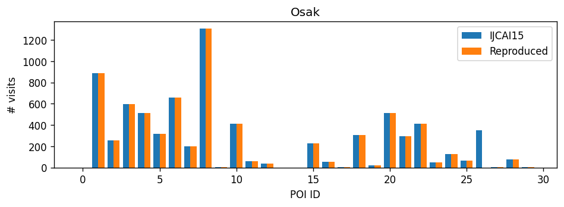

# 2. Re-producing data

Our re-implemented procedure to generate extended datasets uses (1) YFCC100m metadata in `new-meta/` and (2) POI data. This document explains three ways to prepare POI data (corresponding to POI Ext 1, POI Ext 2, and POI Ext 3), but the data generated in POI Ext 3 is not public in this repository to mitigate any license issue.

## 2-1. Preparing POI information

We consider the following four types of POI information.

- POI data reused from public datasets (from IJCAI2015 / CIKM2016),
- (POI Ext 1) Handcrafted POI data by us,
- (POI Ext 2) POI data generated by extracting information from public datasets, and
- (POI Ext 3) Manually collected POI names and collect latitude/longitude information from Google Maps API.

In this repository, public data are stored in `public-data/POI`. Other data (POI Ext 1 - Ext 3) are stored in `extended-data`. To see scatter plots of public POIs, use `src/tour/visualize/plot-POI.py` and results are stored in `figures/POI`. These data are stored in this repository for reviewing purpose.

Note: to visualize all POI locations, run `src/scripts/run_all_poi_plot.sh`.

## 2-2. Generating travel log data

Our re-produced program works as follow.

1. Out of all metadata in `new-meta/`, only collect metadata whose locations (latitude/longitude) are within the range of POI information. The filtered metadata are stored as `dill` format and stored in `extended-data/distance/`.
2. From filtered metadata, we separate photo streams into travel logs with mapping geo-tags into POI ids by mapping. Transformed data are stored in `extended-data/distance-mapping/`. After cleaning up mapped travel logs, our program outputs travel log data in Format-IJCAI2015, stored in `extended-data/Format-IJCAI2015/`.
3. (optional) Convert the file in Format-IJCAI2015 into the file in Format-CIKM2016.

To reproduce this process, the below is an example on Osaka (using `POI-Osak.csv`).

```
# Step 1.
python generator/preprocess-POI-meta.py \
    -city Osak -poiname public-data/POI/POI-Osak.csv


# Step 2.
python generator/generate-Visits.py \
    -city Osak -poiname public-data/POI/POI-Osak.csv

# Step 3.
python generator/convert-Visits-Traj.py -city Osak
```

Note: since `dill` files are large, this repository contains some sample data only (`Osaka`, `Glasgow`, `Kumamoto`). To generate datasets for these cities, run `./scripts/run_generate_example.sh`.

## 2-3. Validate generated data

To validate generate travel log data, we compare public datasets and our generated datasets. Use our script `src/validate/validate-userVisits.py` (Format-IJCAI2015) and `src/validate/validate-traj.py` (Format-CIKM2016) for this purpose.

The below list shows examples for Format-CIKM2016 (userVisits data).

```
# Osak
python src/validate/validate-userVisits.py -city Osak

# Glas
python src/validate/validate-userVisits.py -city Glas
```

Histograms included in our manuscript can be reproduced.

| | POI | Time |
| :-- | :-- | :-- |
| Osaka |  |  |
| Glasgow |  |  |